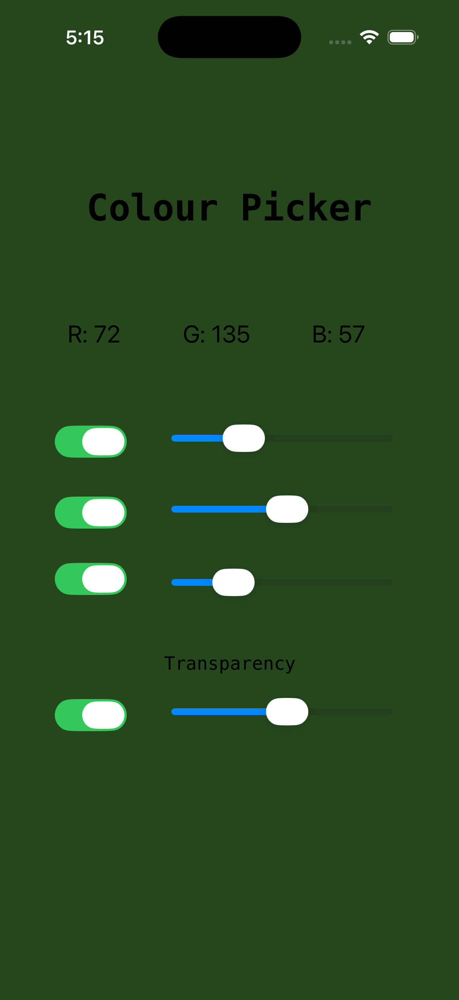
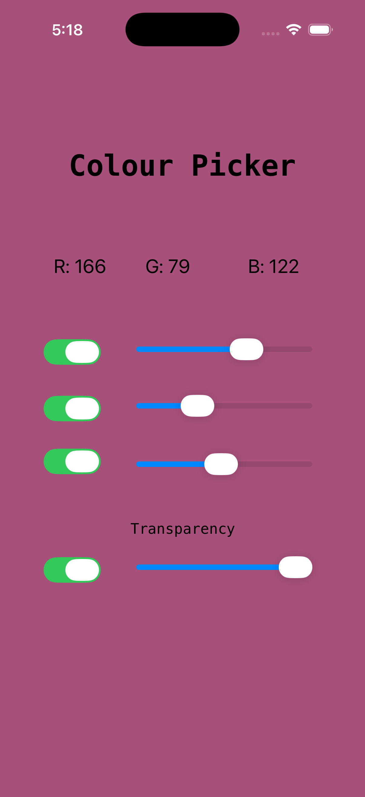

# 🎨 UIKit Color Picker

An interactive iOS app built using **Swift** and **UIKit** that allows users to dynamically select and preview colors in real time.

## 🚀 Features

* Real-time color preview
* RGB slider-based selection
* Instant UI updates

## 🛠 Tech Stack

* Swift
* UIKit
* Storyboard

## 📸 Screenshots

  
  
  
  

## 🧠 Key Learnings

* Event-driven UI handling in UIKit
* Working with Storyboards and IBOutlets
* Managing dynamic UI updates
